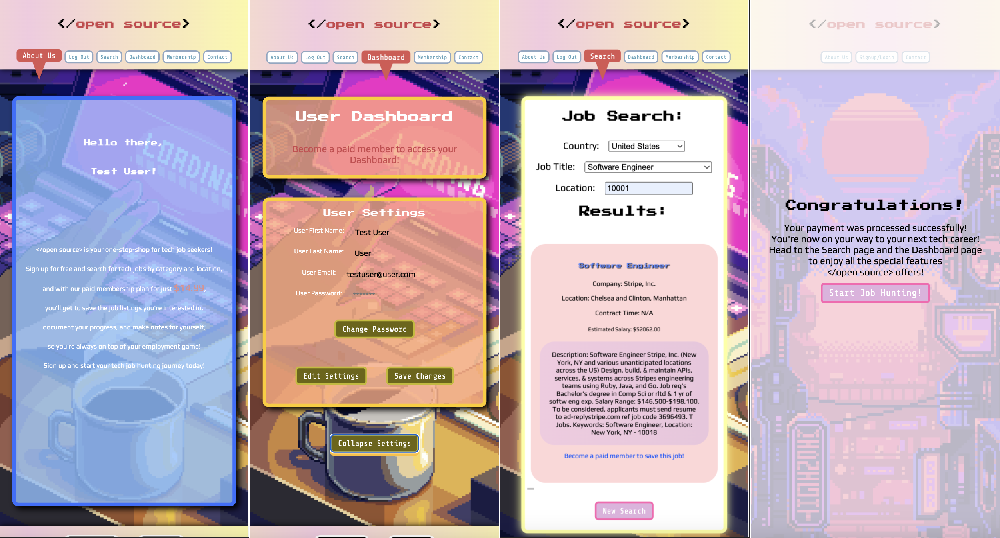

# Open Source - The Tech Job Board

    
## Table of Contents
- [Project Description](#description)
- [Usage](#usage)
- [Installation](#installation)
- [Contributing](#contributing)
- [Questions](#questions)
- [Team Members](#team-members)
- [License](#license)

## Description 
This is an application that allows users to search for tech jobs, save jobs they are interested in, and track their application progress. This is intended to provide users with a centralized platform to browse job openings, save listings that match their interests, and track their application status, making the job search process more streamlined and efficient.

Open Source is deployed on Heroku at: https://open-source.herokuapp.com/

The App's GitHub repo is located at: https://github.com/mshaari/open-source

## Usage
To use the Tech Job Board application, users can simply visit the website, signup, and start searching for tech jobs using keywords and location filters. They can also become a paid member to save job listings they are interested in and track their application progress. Once they have found a job they want to apply for, they can click on the job listing title and be redirected to the job posting on the employer's website.

## Installation
As a progressive web application, the Tech Job Board can be installed through the browser. Users can visit the website and follow the installation prompts on their browser. Once installed, they can access the Tech Job Board through their device's app launcher, just like any other app.
Alternatively, developers can clone the repository and run it locally using a web server. They will need to have Node.js and npm installed on their machine. Once they have cloned the repository, they can run npm install to install the dependencies and npm start to start the development server.

## Contributing
Contributions to the Tech Job Board project are welcome. Developers can fork the repository, make their changes, and submit a pull request to the main repository. Please make sure to follow the project's coding standards and guidelines.

## Questions
If you have any questions or feedback about the Tech Job Board project, you can contact the developers on the project's GitHub page.

## Team Members
 Aviva: https://github.com/AvivaRubenstein

 Eli: https://github.com/crystal-coding-time

 Fred: https://github.com/FeddericoWayne

 Michael: https://github.com/mshaari

## License
Licensed under the [MIT](https://choosealicense.com/licenses/mit/) license.